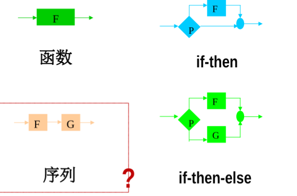
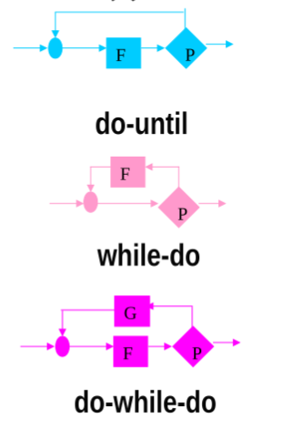
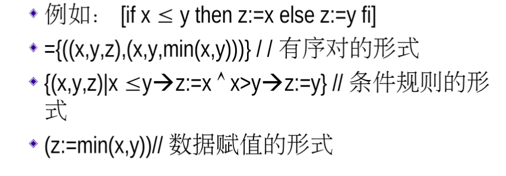
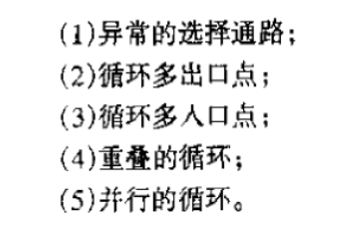

#程序的控制结构
##1、7种基本程序
正规程序由正规子程序组成。
正规程序标准：
1、具有一个入口线和一个出口线。
2、对每一个结点都有一条入口线到出口线的通路通过该结点。

基本程序:仅含一个正规子程序，是一个不可以再分解的正规程序。
顺序结构：函数、序列
选择结构：if-then、if-then-else
循环结构:do-until、while-do、do-while-do

基集合：构造程序的基本程序集合。
<!-- 
```
    mackdowm插图最基础的格式是：
    
    Alternative text：图片的Alternative文本，用来描述图片的关键词，可以不写。最初的本意是当图片因为某种原因不能被显示时而出现的替代文字，后来又被用于SEO，可以方便搜索引擎根据Alt text里面的关键词搜索到图片。 

    link：可以是图片的本地地址、网址。

    "optional title"：鼠标悬置于图片上会出现的标题文字，可以不写。

   使用base64图片编码时格式：

    ![Alternative text][base64 label]  //都是中括号[]

   base64 label:图片Base64编码的标签名。
```
==图片或者路径名字不要有空格，不然会识别不了。==
 -->




##2、程序函数
程序函数表示形式：

##3、结构化程序
###非结构化程序
基本成分：

==结构化定理==：任一正规程序都可以等价于一个由基集合产生的结构化程序。

==#非结构化程序转换为结构化程序==

#程序的正确性证明
